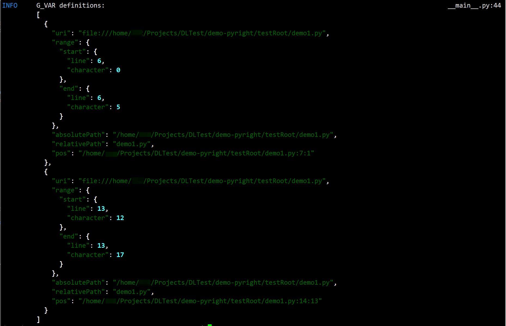

# pyright-multilspy-demo

A very simple demonstration of using pyright language server with `multilspy`.

## Prerequisites

- Python >= 3.12
- Node.js >= v20.10

> Please make sure `python`, `pip` and `node` are in your `PATH` environment variable.

## Usage

1. Initialize dependencies and virtual environment with `uv`

    ```sh
    pip install uv
    uv sync
    ```

2. Initialize `pyright`:

    ```sh
    # -f means force update
    uv run tools/init_pyright.py -f
    ```

3. Run `demo_pyright`:

    ```sh
    uv run -m demo_pyright
    ```

4. You should see the demo result.

    

## Dev Notes

1. Please choose `.venv` as python virtual environment (interpreter) in IDE.

## References

- [pyright](https://github.com/microsoft/pyright)
- [multilspy](https://github.com/multilspy/multilspy)
- [Language Server Protocol Specification](https://microsoft.github.io/language-server-protocol/specifications/specification-current)
